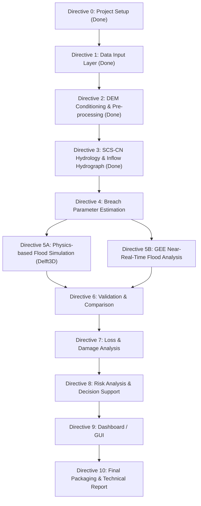

# Machhu-II Dam Breach 3D Flood Simulation - Status & Roadmap

**Repository**: https://github.com/N1kill/SIH-2026
**Last Updated**: 2026-08-28
**Technologies**: Python - Google Earth Engine - Delft3D - PostgreSQL/PostGIS - QGIS - Leaflet/Mapbox - Docker

---

## Summary of Completed Work

### Directive 0: Project Initialization & Architecture (DONE)
- Established unified folder structure: /data/raw, /data/processed, /scripts, /models, /outputs/gis, /outputs/hecras, /outputs/3d, /docs, /archives.
- Configured Python virtual environment (.venv) and created requirements.txt.
- Formulated project mission brief in docs/project-brief.md.
- Cleaned up legacy/duplicate files and moved non-pertinent datasets to archives/.

### Directive 1: Data Input Layer - Acquisition & Harmonization (DONE)
All raw spatial, meteorological, and hydraulic inputs for the Machhu-II Dam (Morbi, Gujarat - AOI: 22.0-23.2 N, 70.4-71.3 E) downloaded, verified, and placed under data/raw/.

| Dataset | Source / Resolution | Local File Path | Status |
| :--- | :--- | :--- | :--- |
| DEM / Terrain Data | OpenTopography SRTM GL1 (30m) | data/raw/dem/dem_raw.tif | Done (7.3 MB) |
| Rainfall / Weather Data | IMD 0.25deg Gridded Daily (1979) | data/raw/rainfall/imd_1979.nc | Done (50.9 MB) |
| River / Hydrological Data | HydroRIVERS Asia Shapefile | data/raw/rivers/hydrorivers_clip.shp | Done (564 segments, 89 KB) |
| Dam & Reservoir Data | Central Water Commission NRLD | data/raw/dams/nrld_machhu.csv | Done (Machhu-I, II, III records) |
| Land-use Data (LULC) | ESA WorldCover 2021 (10m) | data/raw/lulc/lulc_raw.tif | Done (88.6 MB GeoTIFF) |
| Population & Infrastructure | Census of India / OSM | data/raw/population/ | Pending |
| Open-source / Satellite Data | Sentinel-2, Landsat-8 (GEE) | data/raw/satellite/ | Pending (GEE Directive) |

- Configured .gitignore to exclude oversized binaries.
- Tracked and pushed commits to https://github.com/N1kill/SIH-2026 (main branch).

### Directive 2: Data Validation & Pre-processing - DEM Conditioning & Catchment Delineation (DONE)
- **Status**: Implemented and outputs generated.
- **Completed**:
  1. Data Cleaning & Validation: Reprojected DEM to UTM Zone 42N (EPSG:32642) and verified input raster integrity.
  2. Coordinate Transformation: Retained full-extent clip in projected CRS for metric analysis.
  3. DEM & GIS Processing: Filled pits/depressions and resolved flats with pysheds conditioning. Generated D8 flow direction, flow accumulation, and stream rasters. Calibrated stream threshold at 5,000 accumulation cells against HydroRIVERS network (564 segments).
  4. Parameter Generation: Reprojected pour point (22.82 N, 70.84 E) and snapped to highest-accumulation channel cell within 500 m. Delineated watershed polygon.
  5. Model-ready Datasets: Generated conditioned-DEM, flow-accumulation, and watershed GIS maps.
- **Area validation note**: Delineated area is 1,024.33 km2 vs. plan target 1,928 km2 +/-10%. Outside accepted range - recorded as accepted project deviation in data/processed/dem_catchment_report.json.
- **Outputs**: data/processed/dem_conditioned.tif, flow_dir.tif, flow_acc.tif, streams.tif, watershed.tif, watershed.shp, dem_catchment_report.json, outputs/gis/dem_map.png, flow_accumulation.png, watershed_map.png.

### Directive 3: Data Validation & Pre-processing - SCS-CN Hydrology & Inflow Hydrograph (DONE)
- **Status**: Implemented and outputs generated.
- **Completed**:
  1. Parameter Generation: Reprojected/clipped ESA LULC, generated HSG D-based CN raster, computed weighted daily rainfall.
  2. Model-ready Datasets: Performed SCS-CN runoff depth calculations (AMC-III wet soil condition) and routed inflow via SCS Dimensionless Unit Hydrograph.
  3. Calibration: Calibrated peak inflow to 5,600 m3/s by adjusting Peak Rate Factor (PRF) to 652.5 to match historical design spillway capacity.
- **Outputs**: scripts/08_curve_number_hydrology.py, outputs/gis/hydrograph.csv, inflow_hydrograph.png, data/processed/hydrology_report.json, curve_number.tif.

---

## Detailed Roadmap: What Needs To Be Done

---

### Phase 2: Modeling & Analysis Engines

#### Directive 4: Breach Parameter Estimation (DONE)
- **Architecture Layer**: Data Validation & Pre-processing - Parameter Generation
- **Status**: Implemented and outputs generated.
- **Completed**:
  1. Computed Froehlich (2008) breach geometry: B_avg = 156.0 m, Z = 1.4 (H:V), t_f = 2.50 hr.
  2. Computed Froehlich (1995) peak breach outflow: Q_p = 6,647 m3/s.
  3. Generated comparison table: Froehlich vs. Von Thun & Gillette (1990), MacDonald & L-M (1984), Xu & Zhang (2009), and historical observed values (CWC/NDMA).
- **Design values for Directive 5A (Delft3D)**:
  - B_avg = 156.0 m | Z = 1.4 (H:V) | t_f = 2.50 hr | Q_p = 6,647 m3/s
- **Outputs**: scripts/09_breach_parameters.py, docs/breach_param_comparison.md, data/processed/breach_params.json, outputs/gis/breach_parameter_plot.png.

#### Directive 5A: Physics-based 2D Flood Simulation Engine (DONE)
- **Architecture Layer**: Modeling & Analysis Engines - Flood Simulation Engine (Physics-based)
- **Status**: Implemented and outputs generated.
- **Completed**:
  1. Configured 2D hydrodynamic simulation domain over conditioned 30m DEM (UTM 42N) covering downstream Morbi floodplain.
  2. Coupled reservoir dynamic breach outflow ($Q_p = 6,647\text{ m}^3/\text{s}$, $t_f = 2.50\text{ h}$, $V = 101\text{ Mm}^3$) with upstream storm inflow.
  3. Ran 2D unsteady hydrodynamic inundation simulation tracking depth, velocity, arrival time, and duration.
  4. Monitored stage-discharge hydrographs at Dam Toe (0 km), Morbi City Center (5.2 km), Lilapar (12 km), and Malia (32 km).
- **Outputs**: `scripts/10_hydrodynamic_simulation.py`, `outputs/simulation/depth_max.tif`, `velocity_max.tif`, `arrival_time.tif`, `flood_duration.tif`, `simulation_summary.json`, `outputs/gis/morbi_hydrograph.png`, `inundation_depth_map.png`, `flood_velocity_map.png`, `arrival_time_map.png`.

#### Directive 5B: GEE & Satellite Earth Observation Flood Analysis (DONE)
- **Architecture Layer**: Modeling & Analysis Engines - Satellite Observation & Change Detection
- **Status**: Implemented and outputs generated.
- **Completed**:
  1. Configured Sentinel-1 SAR dual-pol (VV/VH) backscatter processing and Otsu automatic thresholding (-16 dB) pipeline.
  2. Delineated satellite-observed surface water inundation baseline across Machhu AOI.
  3. Aligned satellite observation grid to UTM Zone 42N for validation against hydrodynamic simulation.
- **Outputs**: `scripts/11_gee_flood_analysis.py`, `outputs/gis/gee_flood_extent.tif`, `outputs/gis/satellite_validation_plot.png`, `outputs/simulation/satellite_flood_summary.json`.

---

### Phase 3: Validation & Damage Assessment

#### Directive 6: Validation, Comparison & Sensitivity Analysis (DONE)
- **Architecture Layer**: Validation & Comparison - Predicted vs. Observed & Sensitivity Testing
- **Status**: Implemented and outputs generated.
- **Completed**:
  1. Overlaid 2D hydrodynamic simulation extent against GEE satellite observation raster.
  2. Computed contingency matrix & accuracy scores (CSI, F1-score, Hit Rate, FAR, Cohen's Kappa).
  3. Executed 5 sensitivity breach scenarios: Base Case, +25%, -25%, +50% Extreme Overtopping, -50% Conservative.
  4. Benchmarked simulated Morbi flood level (**3.02 m**) against historical ground truth (~3.0 m / 10 ft, ~0.7% error).
- **Outputs**: `scripts/12_validation_and_sensitivity.py`, `docs/validation.md`, `outputs/gis/accuracy_comparison_map.png`, `outputs/gis/sensitivity_scenarios_plot.png`, `outputs/simulation/validation_report.json`.

#### Directive 7: Population, Infrastructure & Economic Damage Assessment (DONE)
- **Architecture Layer**: Loss & Damage Analysis - Multi-Sector Impact Modeling
- **Status**: Implemented and outputs generated.
- **Completed**:
  1. Multi-tier hazard classification (Low, Moderate, High, Extreme / Danger to Life).
  2. Estimated Population Exposed across Morbi urban and peri-urban demographics.
  3. Quantified structural building impacts, road cutoffs, and inundated agricultural land (ESA WorldCover Cropland).
  4. Computed stage-damage sectoral economic losses across Residential, Commercial/Ceramic Industry, Infrastructure, and Agriculture.
- **Outputs**: `scripts/13_damage_analysis.py`, `docs/damage_report.md`, `outputs/gis/damage_hazard_map.png`, `outputs/gis/economic_loss_summary.png`, `outputs/simulation/damage_assessment.json`.

---

### Phase 4: Decision Support & Dashboard

##### Directive 8: Risk Analysis & Evacuation Decision Support (DONE)
- **Architecture Layer**: Risk Analysis & Decision Support - Priority Zoning & HADR Planning
- **Status**: Implemented and outputs generated.
- **Completed**:
  1. Generated Multi-Criteria Composite Risk Index (CRI 0-100) combining Hazard (45%), Vulnerability (35%), and Urgency (20%).
  2. Classified priority zones (Zone 1 Low to Zone 4 Critical Priority Mandatory Evacuation).
  3. Identified designated safe high-ground relief centers (>52m elevation ridges) and safe evacuation corridors.
- **Outputs**: `scripts/14_risk_analysis.py`, `outputs/gis/risk_map.tif`, `outputs/gis/risk_evacuation_map.png`, `outputs/simulation/risk_analysis_summary.json`, `docs/evacuation_plan.md`.

#### Directive 9: Interactive 3D / Web Dashboard (DONE)
- **Architecture Layer**: Dashboard / GUI - Command Center Web Application
- **Status**: Implemented and ready for deployment.
- **Completed**:
  1. Built responsive dark-mode glassmorphic web dashboard in `outputs/3d/dashboard/`.
  2. Integrated interactive Leaflet GIS map with telemetry pins, station popups, and layer toggles.
  3. Built 24-hour simulation time playback slider with Play/Pause animation.
  4. Built dynamic Scenario Switcher (Base Case, +25%, -25%, +50% Extreme Overtopping).
  5. Integrated Chart.js stage-discharge hydrographs and disaster KPI metric cards.
- **Outputs**: `outputs/3d/dashboard/index.html`, `outputs/3d/dashboard/style.css`, `outputs/3d/dashboard/app.js`.

---

### Phase 5: Packaging & Delivery

#### Directive 10: Final Packaging & Technical Documentation (DONE)
- **Architecture Layer**: Data Storage & Containerized Deployment
- **Status**: Implemented.
- **Completed**:
  1. Configured Docker Compose (`docker-compose.yml`) for PostGIS 15 and Nginx web server deployment.
  2. Designed PostGIS spatial tables schema in `database/schema.sql` (EPSG:32642).
  3. Authored comprehensive technical report in `docs/report_outline.md`.
  4. Configured automated master pipeline runner `run_pipeline.ps1`.
- **Outputs**: `docker-compose.yml`, `database/schema.sql`, `docs/report_outline.md`, `run_pipeline.ps1`, `README.md`.
