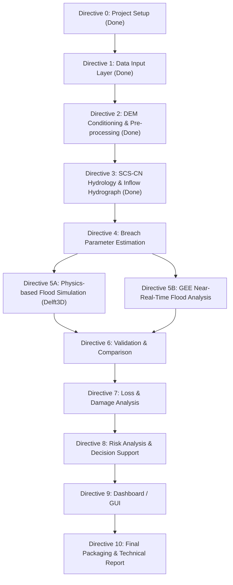

# Machhu-II Dam Breach 3D Flood Simulation - Status & Roadmap

**Repository**: https://github.com/N1kill/SIH-2026
**Last Updated**: 2026-08-28
**Technologies**: Python - Google Earth Engine - Delft3D - PostgreSQL/PostGIS - QGIS - Leaflet/Mapbox - Docker

---

## Summary of Completed Work

### Directive 0: Project Initialization & Architecture (DONE)
- Established unified folder structure: /data/raw, /data/processed, /scripts, /models, /outputs/gis, /outputs/hecras, /outputs/3d, /docs, /archives.
- Configured Python virtual environment (.venv) and created requirements.txt.
- Formulated project mission brief in docs/project-brief.md.
- Cleaned up legacy/duplicate files and moved non-pertinent datasets to archives/.

### Directive 1: Data Input Layer - Acquisition & Harmonization (DONE)
All raw spatial, meteorological, and hydraulic inputs for the Machhu-II Dam (Morbi, Gujarat - AOI: 22.0-23.2 N, 70.4-71.3 E) downloaded, verified, and placed under data/raw/.

| Dataset | Source / Resolution | Local File Path | Status |
| :--- | :--- | :--- | :--- |
| DEM / Terrain Data | OpenTopography SRTM GL1 (30m) | data/raw/dem/dem_raw.tif | Done (7.3 MB) |
| Rainfall / Weather Data | IMD 0.25deg Gridded Daily (1979) | data/raw/rainfall/imd_1979.nc | Done (50.9 MB) |
| River / Hydrological Data | HydroRIVERS Asia Shapefile | data/raw/rivers/hydrorivers_clip.shp | Done (564 segments, 89 KB) |
| Dam & Reservoir Data | Central Water Commission NRLD | data/raw/dams/nrld_machhu.csv | Done (Machhu-I, II, III records) |
| Land-use Data (LULC) | ESA WorldCover 2021 (10m) | data/raw/lulc/lulc_raw.tif | Done (88.6 MB GeoTIFF) |
| Population & Infrastructure | Census of India / OSM | data/raw/population/ | Pending |
| Open-source / Satellite Data | Sentinel-2, Landsat-8 (GEE) | data/raw/satellite/ | Pending (GEE Directive) |

- Configured .gitignore to exclude oversized binaries.
- Tracked and pushed commits to https://github.com/N1kill/SIH-2026 (main branch).

### Directive 2: Data Validation & Pre-processing - DEM Conditioning & Catchment Delineation (DONE)
- **Status**: Implemented and outputs generated.
- **Completed**:
  1. Data Cleaning & Validation: Reprojected DEM to UTM Zone 42N (EPSG:32642) and verified input raster integrity.
  2. Coordinate Transformation: Retained full-extent clip in projected CRS for metric analysis.
  3. DEM & GIS Processing: Filled pits/depressions and resolved flats with pysheds conditioning. Generated D8 flow direction, flow accumulation, and stream rasters. Calibrated stream threshold at 5,000 accumulation cells against HydroRIVERS network (564 segments).
  4. Parameter Generation: Reprojected pour point (22.82 N, 70.84 E) and snapped to highest-accumulation channel cell within 500 m. Delineated watershed polygon.
  5. Model-ready Datasets: Generated conditioned-DEM, flow-accumulation, and watershed GIS maps.
- **Area validation note**: Delineated area is 1,024.33 km2 vs. plan target 1,928 km2 +/-10%. Outside accepted range - recorded as accepted project deviation in data/processed/dem_catchment_report.json.
- **Outputs**: data/processed/dem_conditioned.tif, flow_dir.tif, flow_acc.tif, streams.tif, watershed.tif, watershed.shp, dem_catchment_report.json, outputs/gis/dem_map.png, flow_accumulation.png, watershed_map.png.

### Directive 3: Data Validation & Pre-processing - SCS-CN Hydrology & Inflow Hydrograph (DONE)
- **Status**: Implemented and outputs generated.
- **Completed**:
  1. Parameter Generation: Reprojected/clipped ESA LULC, generated HSG D-based CN raster, computed weighted daily rainfall.
  2. Model-ready Datasets: Performed SCS-CN runoff depth calculations (AMC-III wet soil condition) and routed inflow via SCS Dimensionless Unit Hydrograph.
  3. Calibration: Calibrated peak inflow to 5,600 m3/s by adjusting Peak Rate Factor (PRF) to 652.5 to match historical design spillway capacity.
- **Outputs**: scripts/08_curve_number_hydrology.py, outputs/gis/hydrograph.csv, inflow_hydrograph.png, data/processed/hydrology_report.json, curve_number.tif.

---

## Detailed Roadmap: What Needs To Be Done

---

### Phase 2: Modeling & Analysis Engines

#### Directive 4: Breach Parameter Estimation
- **Architecture Layer**: Data Validation & Pre-processing - Parameter Generation
- **Tasks**:
  1. Compute Froehlich (2008) breach geometry equations - average breach width B_avg, side slopes Z, formation time t_f - using dam height (22.56 m) and reservoir volume (101 Mm3).
  2. Compute peak breach outflow using Froehlich (1995) peak flow regression.
  3. Formulate comparison table: Froehlich empirical estimates vs. Wahl (1998) historical observed breach dimensions.
- **Outputs**: scripts/09_breach_parameters.py, docs/breach_param_comparison.md, data/processed/breach_params.json.

#### Directive 5A: Physics-based Flood Simulation Engine (Delft3D)
- **Architecture Layer**: Modeling & Analysis Engines - Flood Simulation Engine (Physics-based) - SPH Model / Delft3D Model / Scenario Simulation
- **Tasks**:
  1. Configure Delft3D-FLOW 2D hydrodynamic model domain over the downstream Morbi floodplain (~30-50 m resolution).
  2. Set up reservoir storage elevation-volume relationship and upstream boundary condition (inflow hydrograph from Directive 3).
  3. Configure dam-breach mechanics using Froehlich parameters from Directive 4.
  4. Run base-case 2D unsteady hydrodynamic simulation (Dam Break + River flow scenarios).
  5. Extract predicted flood outputs: Inundation Extent, Water Depth, Flow Velocity, Flood Arrival Time, Flood Duration.
- **Outputs**: models/delft3d/, outputs/simulation/depth_max.tif, velocity_max.tif, arrival_time.tif, flood_duration.tif.

#### Directive 5B: GEE Near-Real-Time Flood Analysis (Observation-based)
- **Architecture Layer**: Modeling & Analysis Engines - GEE Near-Real-Time Flood Analysis (Observation-based)
- **Tasks**:
  1. Authenticate and configure Google Earth Engine Python API.
  2. Fetch Sentinel-1 SAR and Sentinel-2/Landsat-8 optical imagery for the Machhu-II AOI.
  3. Apply SAR-based flood detection algorithms to derive observed inundation extent and water spread.
  4. Compute change detection between pre-flood and post-flood imagery. Estimate update frequency and current flood status.
  5. Export satellite-based flood map as GeoTIFF for Validation (Directive 6).
- **Outputs**: scripts/10_gee_flood_analysis.py, outputs/gis/gee_flood_extent.tif, gee_change_detection.tif.

---

### Phase 3: Validation & Damage Assessment

#### Directive 6: Validation & Comparison
- **Architecture Layer**: Validation & Comparison - Predicted vs. Observed, Accuracy Assessment, Model Validation
- **Tasks**:
  1. Overlay Delft3D predicted flood extent (Directive 5A) against GEE observed/satellite flood extent (Directive 5B).
  2. Compute accuracy metrics: F1-score, Critical Success Index (CSI), Hit Rate, False Alarm Ratio.
  3. Execute sensitivity simulations varying breach width & formation time by +/-25% and +/-50% to quantify uncertainty.
  4. Benchmark simulated peak inundation depths at Morbi city center against historical accounts (~10 ft / 3.0 m flood level).
- **Outputs**: docs/validation.md, outputs/simulation/sensitivity/, outputs/gis/accuracy_map.png.

#### Directive 7: Loss & Damage Analysis
- **Architecture Layer**: Loss & Damage Analysis - Population Affected, Buildings Affected, Roads & Infrastructure, Agriculture Loss, Economic Loss
- **Tasks**:
  1. Overlay maximum flood depth raster with population density layer (Census of India) to estimate Population Affected.
  2. Overlay with OSM building footprints to estimate Buildings Affected.
  3. Overlay with road network to estimate Roads & Infrastructure damage.
  4. Overlay with LULC agricultural class to estimate Agriculture Loss.
  5. Apply damage functions to compute approximate Economic Loss estimates.
- **Outputs**: scripts/11_damage_analysis.py, docs/damage_report.md, outputs/gis/damage_maps/.

---

### Phase 4: Decision Support & Dashboard

#### Directive 8: Risk Analysis & Decision Support
- **Architecture Layer**: Risk Analysis & Decision Support - Risk Mapping, Vulnerability Assessment, Priority Areas, Evacuation/HADR Support, Decision Support
- **Tasks**:
  1. Generate composite Risk Maps combining flood depth, velocity, and population exposure.
  2. Perform Vulnerability Assessment for Morbi city - classify zones as High / Medium / Low risk.
  3. Identify Priority Areas for evacuation and emergency response.
  4. Draft Evacuation Routes and HADR (Humanitarian Assistance & Disaster Relief) support recommendations.
- **Outputs**: scripts/12_risk_analysis.py, outputs/gis/risk_map.tif, docs/evacuation_plan.md.

#### Directive 9: Dashboard / GUI - Web Visualization
- **Architecture Layer**: Dashboard / GUI - Interactive Maps, Simulation Visualization, Near-Real-Time Flood Status, Depth/Velocity/Arrival Time Maps, Loss & Damage & Risk Maps, Scenario Comparison, Charts/Reports/Export
- **Tasks**:
  1. Build responsive Leaflet/Mapbox web application in outputs/3d/dashboard/.
  2. Implement Interactive Maps: flood depth, velocity, arrival time, and risk zones.
  3. Implement Scenario Comparison panel: base-case vs. +/-25% / +/-50% breach scenarios.
  4. Add Simulation Visualization with playback time slider for time-series flood progression.
  5. Integrate Near-Real-Time Flood Status panel using GEE outputs (Directive 5B).
  6. Add Loss & Damage and Risk Map overlays with exportable charts and reports.
- **Outputs**: outputs/3d/dashboard/index.html, app.js, style.css.

---

### Phase 5: Packaging & Delivery

#### Directive 10: Final Packaging & Technical Report
- **Architecture Layer**: Data Storage & Management (PostgreSQL/PostGIS, Cloud Storage, Scenario Repository) - Export & Reports (PDF, CSV/Excel, GeoTIFF/KML)
- **Tasks**:
  1. Finalize PostgreSQL/PostGIS spatial database schema and load all model outputs via Docker container.
  2. Configure Docker Compose for reproducible deployment of the full simulation pipeline.
  3. Create comprehensive technical project report in docs/report_outline.md covering methodology, results, validation, and conclusions.
  4. Export all outputs in PDF Report, CSV/Excel, and GeoTIFF/KML formats for stakeholder delivery.
  5. Verify all references, citations, and repository artifacts; update README.md.
- **Outputs**: docs/report_outline.md, docs/final_report.pdf, README.md, docker-compose.yml, database/schema.sql.
