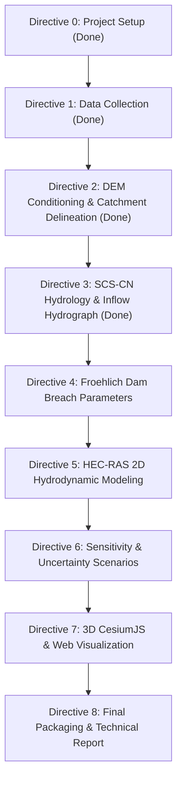

# Machhu-II Dam Breach 3D Flood Simulation — Status & Roadmap

**Repository**: [https://github.com/N1kill/SIH-2026](https://github.com/N1kill/SIH-2026)  
**Last Updated**: 2026-08-28  

---

## 📊 Summary of Completed Work (Directives 0 & 1)

### ✅ 1. Project Initialization & Architecture (Directive 0)
- Established unified folder structure: `/data/raw`, `/data/processed`, `/scripts`, `/models`, `/outputs/gis`, `/outputs/hecras`, `/outputs/3d`, `/docs`, `/archives`.
- Configured Python virtual environment (`.venv`) and created [`requirements.txt`](../requirements.txt).
- Formulated project mission brief in [`docs/project-brief.md`](project-brief.md).
- Cleaned up legacy/duplicate files and moved non-pertinent datasets to [`archives/`](../archives/).

### ✅ 2. Automated Data Acquisition & Harmonization (Directive 1)
All raw spatial, meteorological, and hydraulic inputs for the Machhu-II Dam (Morbi, Gujarat — AOI: 22.0–23.2°N, 70.4–71.3°E) have been downloaded, verified, and placed under `data/raw/`:

| Dataset | Source / Resolution | Local File Path | Status |
| :--- | :--- | :--- | :--- |
| **DEM** | OpenTopography SRTM GL1 (30m) | `data/raw/dem/dem_raw.tif` | ✅ Downloaded (7.3 MB) |
| **Rainfall** | IMD 0.25° Gridded Daily (1979) | `data/raw/rainfall/imd_1979.nc` | ✅ Downloaded (50.9 MB) |
| **River Network** | HydroRIVERS Asia Shapefile | `data/raw/rivers/hydrorivers_clip.shp` | ✅ Clipped to AOI (564 river segments, 89 KB) |
| **Dam Register** | Central Water Commission NRLD | `data/raw/dams/nrld_machhu.csv` | ✅ Extracted (Machhu-I, II, III records) |
| **LULC** | ESA WorldCover 2021 (10m) | `data/raw/lulc/lulc_raw.tif` | ✅ Downloaded (88.6 MB GeoTIFF) |

### ✅ 3. Repository Version Control & Synchronization
- Configured [`.gitignore`](../.gitignore) to exclude oversized binaries while retaining critical models, documentation, code, and clipped spatial layers.
- Tracked and pushed code and data commits to `https://github.com/N1kill/SIH-2026` (`main` branch).

---

## 🗺️ Detailed Roadmap: What Needs To Be Done

---

### ⏳ Phase 1: Hydrology & Catchment Analysis

#### **Directive 2: DEM Conditioning & Catchment Delineation**
- **Status**: ✅ Implemented and outputs generated.
- **Completed**:
  1. Reprojected the DEM to UTM Zone 42N (**EPSG:32642**) and retained a full-extent clip.
  2. Filled pits/depressions and resolved flats with `pysheds` conditioning.
  3. Generated D8 flow direction, flow accumulation, and stream rasters.
  4. Reprojected the pour point (**22.82°N, 70.84°E**) and snapped it to the highest-accumulation channel cell within 500 m.
  5. Delineated watershed raster and polygon outputs; calculated area and wrote a validation report.
  6. Calibrated the stream threshold against the clipped HydroRIVERS network (564 segments): **5,000 accumulation cells** selected.
  7. Generated conditioned-DEM, flow-accumulation, and watershed GIS maps.
- **Area validation note**: The delineated area is **1,024.33 km²**, compared with the plan target of **1,928 km² ± 10%** (accepted range **1,735.20–2,120.80 km²**). It is outside that range, but is an accepted project deviation. The target and observed value remain recorded in `data/processed/dem_catchment_report.json`.
- **Performance note**: Existing-output reruns are fast. A full fresh-run benchmark has not yet demonstrated the original 2–5 minute target on this Windows/Python 3.13 machine.
- **Outputs**: `data/processed/dem_conditioned.tif`, `data/processed/flow_dir.tif`, `data/processed/flow_acc.tif`, `data/processed/streams.tif`, `data/processed/pour_point.shp`, `data/processed/pour_point_snapped.shp`, `data/processed/watershed.tif`, `data/processed/watershed.shp`, `data/processed/dem_catchment_report.json`, and `outputs/gis/{dem_map.png,flow_accumulation.png,watershed_map.png}`.
- **Tasks**:
  1. Compute Froehlich (2008) breach geometry equations (average breach width $B_{avg}$, side slopes $Z$, formation time $t_f$) using dam height (22.56 m) and reservoir volume (101 Mm³).
  2. Formulate comparison table comparing Froehlich empirical estimates vs. Wahl (1998) historical observed breach dimensions.
- **Outputs**: `scripts/09_breach_parameters.py`, `docs/breach_param_comparison.md`.

#### **Directive 5: HEC-RAS 2D Hydrodynamic Modeling**
- **Tasks**:
  1. Script HEC-RAS 2D project via `ras-commander`.
  2. Construct computational 2D mesh over the downstream Morbi floodplain (~30–50m resolution).
  3. Set up reservoir storage elevation-volume relationship and upstream boundary condition (inflow hydrograph).
  4. Configure breach mechanics in HEC-RAS Unsteady Flow editor using Froehlich parameters.
  5. Run 2D unsteady hydrodynamic simulation and extract maximum flood depth, velocity, and arrival time rasters.
- **Outputs**: `outputs/hecras/depth_max.tif`, `outputs/hecras/velocity_max.tif`, `outputs/hecras/arrival_time.tif`.

---

### ⏳ Phase 3: Validation, 3D Web Prototype & Packaging

#### **Directive 6: Sensitivity Analysis & Validation**
- **Tasks**:
  1. Execute sensitivity simulations varying breach width & formation time by $\pm 25\%$ and $\pm 50\%$.
  2. Benchmark simulated peak inundation depths at Morbi city center against qualitative historical accounts (~10 ft / 3.0 m flood level).
- **Outputs**: `docs/validation.md`, `outputs/hecras/sensitivity/`.

#### **Directive 7: 3D Visualization Prototype**
- **Tasks**:
  1. Build a responsive CesiumJS web application in `outputs/3d/cesium_app/`.
  2. Overlay time-series flood depth GeoTIFFs dynamically over 3D terrain.
  3. Include UI controls: playback time slider, breach scenario selector ($\pm 25\%, \pm 50\%$), and depth legend.
- **Outputs**: `outputs/3d/cesium_app/index.html`, `outputs/3d/cesium_app/app.js`.

#### **Directive 8: Final Packaging & Submission Ready Documentation**
- **Tasks**:
  1. Create comprehensive technical project report outline in `docs/report_outline.md`.
  2. Verify all references, citations, and repository artifacts.
- **Outputs**: `docs/report_outline.md`, `README.md`.
